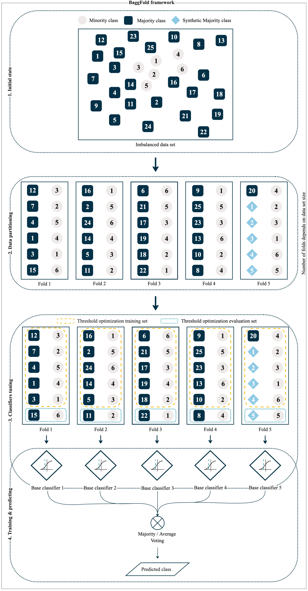

# Official implementation of BaggFold
Bagging Folds using Synthetic Majority Oversampling is a novel approach designed to address
the challenges of binary imbalanced data classification. It is a meta framework
that incorporates techniques such as data partitioning, threshold optimization, oversampling
of the majority class and classifier ensemble.

In the initial stage, BaggFold divides the data set into perfectly balanced folds, each containing an equal
number of minority and majority instances. The majority of instances are selected without replacement.

In the second step, each fold is uniquely assigned to a base classifier.
Subsequently, each classifier fine-tunes its decision threshold using Youden's J statistics.

The final step involves training in a modified bagging fashion, where BaggFold performs both training and inference
concurrently. This approach enhances performance and reduces inference times, contributing to the overall
efficiency of the framework.



This repository also implements two SMOTE techniques:
* Center Point SMOTE (CP-SMOTE),
* Inner and Outer SMOTE (IO-SMOTE).

Both are presented in a paper [Two novel smote methods for solving imbalanced classification problems](https://ieeexplore.ieee.org/abstract/document/10016726)
by Yuan Bao & Sibo Yang.


## Setting up & running
1. Create virtual environment
```bash
conda create --name baggfold python=3.8 
```
2. Activate created virtual environment
```bash
conda activate baggfold
```
3. Within virtual env run
```bash
python install.py
```
4. Run script (3 BaggFold variants on multiple datasets)
```bash
python main.py
```

In [this directory](src/baggfold) there is a BaggFold implementation.